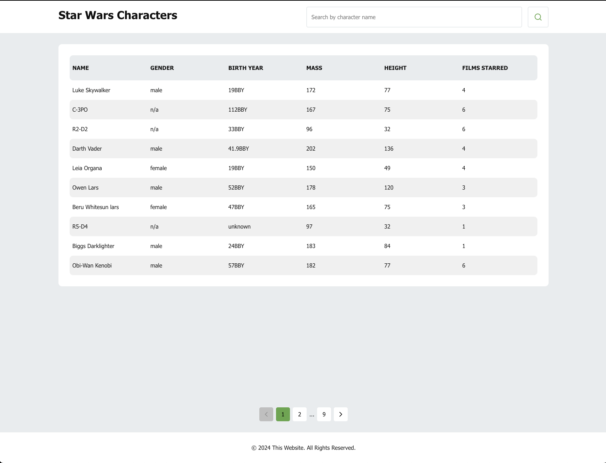
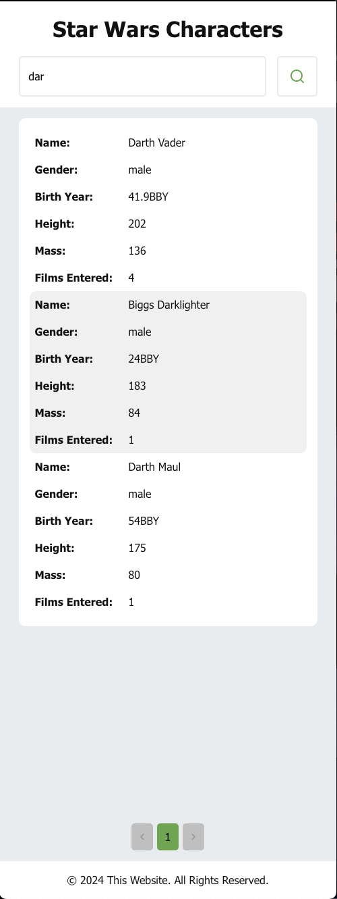

# SWAPI Tech Challenge

This Web App lets users search for [Star Wars Characters](https://swapi.dev/api/people/) available in SWAPI.

Below, there's an overview of what the app looks like, in both desktop and mobile

### Desktop



### Mobile



## System Requirements

- [NodeJs](https://nodejs.org/en) - Javascript Runtime

## Install Dependencies

```shell
$ npm install
```

## Stack description

- [react](https://react.dev/) as a frontend library
- [react-query](https://tanstack.com/query/latest) as a server state manager
- [styled-components](https://styled-components.com/) as a css-in-js solution
- [react-feather](https://feathericons.com/) as the source of the apps icons
- [vitest](https://vitest.dev/) as the unit test runner

## Available Scripts

#### npm start

```shell
$ npm start
```

This command will start the app in development mode in this address: http://localhost:5173/

#### npm build

```shell
$ npm run build
```

This command will build the app in production mode and place the compiled app inside the `dist` folder in the root directory.

#### npm test

```shell
$ npm test
```

This command will run all the unit tests present in this repo.

#### npm test:watch

```shell
$ npm run test:watch
```

This command will run all the unit tests present in this repo in watch mode, i.e it will watch for changes in the files and run the unit tests when the files change.

#### npm run preview

```shell
$ npm run preview
```

This command will run the app on a local server but `npm run build` must be ran first.
